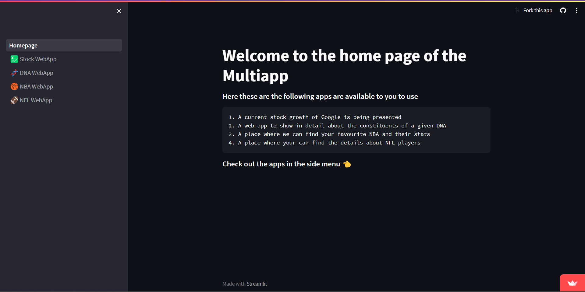

# Python + Streamlit Webapps

## Overview

This Python-based project consists of multiple web applications built using Streamlit. Each web app serves a unique purpose, allowing users to access and interact with various data and information.

### Web Apps

1. **Stock of Google**
   - Description: This web app provides real-time stock price information for Google. Users can track the stock's performance over time and analyze historical data.

2. **DNA**
   - Description: The DNA web app offers tools for DNA sequence analysis. Users can input DNA sequences, perform tasks like sequence alignment, and visualize results.

3. **NBA**
   - Description: Users can explore NBA statistics, including player profiles, team information, and game stats. The app provides insights into the current NBA season and historical data.

4. **NFL**
   - Description: Similar to the NBA app, this web app offers NFL statistics, including player profiles, team details, and game data. Users can access information about the current NFL season and historical records.

### Access the Web Apps

You can access all the web apps by visiting the following link: [Python + Streamlit Webapps](https://python-multiapp.streamlit.app/)

## Usage

1. Visit the provided link to access the web apps.

2. Navigate through the different web apps by selecting the desired option from the menu on the left side of the web page.

3. Interact with each app's user interface to explore and analyze the relevant data or information.

## Dependencies

The project relies on the following Python libraries and tools:

- [Streamlit](https://streamlit.io/): Used for creating the web application interface.
- Additional Python libraries specific to each app, such as Pandas, Plotly, and data analysis libraries.

